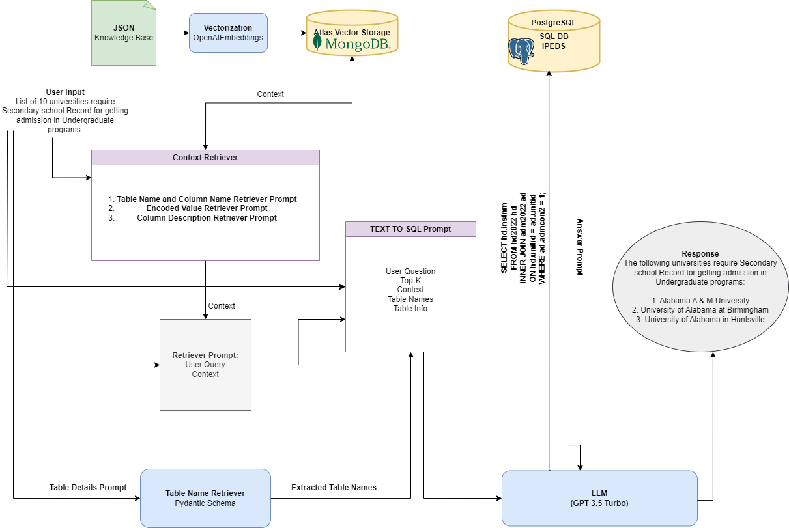
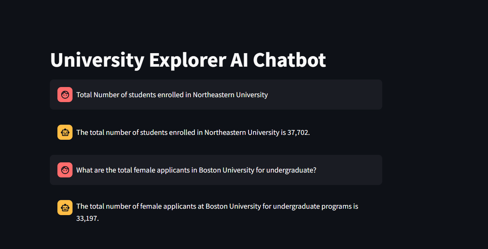

## LLM Chatbot

## Description

This repository contains the code for the Langchain and LlamaIndex chatbots, which utilize natural language to SQL processing with Langchain and LLamaIndex using OpenAI GPT-3.5 Turbo LLM engine. The data source for these chatbots is IPEDS (Integrated Postsecondary Education Data System).



### IPEDS (Integrated Postsecondary Education Data System)

IPEDS is a comprehensive data source maintained by the National Center for Education Statistics (NCES), which collects data from all primary providers of postsecondary education in the United States. It covers various aspects of postsecondary education, including enrollment, graduation rates, financial aid, institutional characteristics, and more.

## Getting Started

Follow these instructions to get the project up and running on your local machine.

### Prerequisites

Make sure you have Python 3.11 installed on your system.

### 1. Cloning the Repository

Clone the repository using the following command:

```bash
https://github.com/enggabhishek/ipedsllm.git
```

### 2. Setting up a Virtual Environment

#### Windows

```bash
# Create a virtual environment
python -m venv venv

# Activate the virtual environment
venv\Scripts\activate
```

#### macOS/Linux

```bash
# Create a virtual environment
python3.11 -m venv venv

# Activate the virtual environment
source venv/bin/activate
```

### 3. Installing Requirements

Install the project dependencies using pip:

```bash
pip install -r requirements.txt
```

### 4. Creating `.env` File

Create a `.env` file in the root directory of the project and save the following details:

```
OPENAI_API_KEY=YOUR_OPENAI_API_KEY
LANGCHAIN_TRACING_V2=YOUR_LANGCHAIN_TRACING_V2_SETTING
LANGCHAIN_ENDPOINT=YOUR_LANGCHAIN_ENDPOINT
LANGCHAIN_API_KEY=YOUR_LANGCHAIN_API_KEY
DB_URL = YOUR POSTGRES DATABASE URL
DB_Name = YOUR MONGODB DATABASE NAME
MONGODB_URI = YOUR MONGODB URI
COLLECTION_NAME = YOUR MONGODB COLLECTION NAME
ATLAS_VECTOR_SEARCH_INDEX_NAME = YOUR MONGO DB VECTOR INDEX
```

Replace `YOUR_OPENAI_API_KEY`, `YOUR_LANGCHAIN_TRACING_V2_SETTING`, `YOUR_LANGCHAIN_ENDPOINT`, `YOUR_LANGCHAIN_API_KEY`, `YOUR POSTGRES DATABASE URL`, `YOUR MONGODB DATABASE NAME`, `YOUR MONGODB URI`, `YOUR MONGODB COLLECTION NAME` and `YOUR MONGODB VECTOR INDEX` with appropriate values.

### 5. Running the Chatbots

To run the Langchain chatbot with Streamlit, use the following command:

```bash
streamlit run src/langchain_chatbot/components/main.py
```

To run the LlamaIndex chatbot with Streamlit, use the following command:

```bash
streamlit run src/llamaIndex_chat/components/main.py
```

